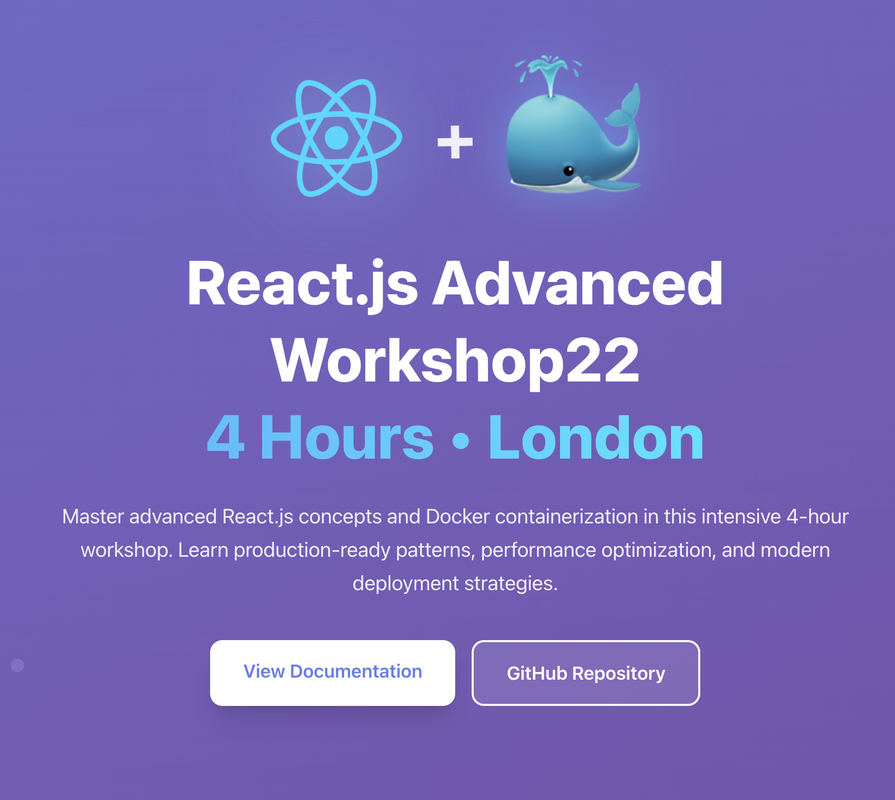

# ⚛️ React.js Advanced Workshop - 4 Hours • London

[](https://opensource.org/licenses/MIT)
[](https://www.docker.com/)
[](https://reactjs.org/)
[](https://www.typescriptlang.org/)
[](https://vitejs.dev/)

An intensive **4-hour advanced React.js workshop** designed for developers in London who want to master Docker containerization for React.js applications. This hands-on workshop guides participants through containerizing a React.js application from scratch, learning Docker fundamentals, multi-stage builds, Docker Compose, and deployment strategies.

This repository contains all the materials, code examples, and **interactive workshop tasks** for the **React.js Advanced Workshop** held in London. The workshop includes step-by-step tasks with timers, progress tracking, and Docker concepts explanations.

## 🚀 Demo

<div align="center">
  
</div>

## 🎯 Workshop Objectives

By the end of this 4-hour workshop, you will:

- 🐳 **Master Docker Fundamentals** - Images, containers, Dockerfiles, Docker Compose, and Docker Hub
- 📦 **Create Production-Ready Dockerfiles** - Multi-stage builds with NGINX and Node.js serve
- ⚡ **Set Up Development Environment** - Docker Compose with hot reload and file watching
- 🔧 **Optimize Docker Builds** - .dockerignore, layer caching, and image size optimization
- 🚀 **Deploy to Docker Hub** - Push and share containerized applications
- 📚 **Learn Best Practices** - Security, performance, and production deployment strategies

## ✨ Workshop Features

- 🎯 **10 Interactive Tasks** (+ 1 Optional) - Step-by-step guide to containerize React.js apps from scratch
- ⏱️ **Progress Tracking** - Built-in timers for each task with completion tracking
- 📚 **Docker Concepts** - Comprehensive explanations with links to official documentation
- 📖 **Commands Reference** - Quick reference for Docker commands (images, containers, volumes, compose)
- 🐳 **Multi-stage Docker builds** - Production-ready Dockerfiles with NGINX and Node.js serve
- 🔧 **Docker Compose Services** - 4 services: production, development, testing, and linting
- 🎁 **Rewards System** - Book discount rewards for completing all tasks on time
- 💾 **LocalStorage Persistence** - Progress saved automatically, survives page refreshes
- 🔒 **Security Best Practices** - Non-root users, minimal images, and secure configurations

## 🛠️ Tech Stack

- **Frontend**: React 19, TypeScript, Tailwind CSS
- **Build Tool**: Vite 7.1.5
- **Testing**: Vitest, React Testing Library
- **Containerization**: Docker, Docker Compose
- **Web Servers**:
  - NGINX Unprivileged (production - port 8080)
  - Node.js serve (alternative production - port 8080)
  - Vite dev server (development - port 5173)
- **Node.js**: 24.11.1 Alpine

## 📋 Prerequisites

- [Docker](https://www.docker.com/get-started) (v20.10+)
- [Docker Compose](https://docs.docker.com/compose/install/) (v2.0+)
- [Node.js](https://nodejs.org/) (v24+) - for local development
- [npm](https://www.npmjs.com/) or [yarn](https://yarnpkg.com/) - for local development

## 📋 Workshop Tasks (10 Tasks + 1 Optional - ~1 hour 30 minutes)

The workshop consists of **10 hands-on tasks** (plus 1 optional) that guide you through containerizing a React.js application:

1. **Get the Sample Application** (5 min) - Clone or create the React.js project
2. **Build and Test Locally** (5 min) - Verify the app works before containerizing
3. **Generate Docker Files** (5 min) - Use `docker init` to scaffold Docker configuration
4. **Create Production Dockerfile** (15 min) - Multi-stage build with NGINX + nginx.conf
5. **Create .dockerignore File** (10 min) - Optimize build context and image size
6. **Create Development Dockerfile** (10 min) - Hot reload with Docker Compose watch
7. **Create Dockerfile with Serve** (10 min) - Alternative production option with Node.js serve
8. **Scan Image for Vulnerabilities** (5 min) - Use Docker Scout to check for security issues
9. **Push to Docker Hub** (10 min) - Share your containerized application
10. **Set Up GitHub Actions CI/CD** (15 min) - ⚙️ **Optional** - Automate builds and pushes with GitHub Actions

Each task includes:

- ⏱️ Estimated completion time
- 📝 Step-by-step instructions
- 💡 Helpful tips and best practices
- ⏱️ Built-in timer to track your progress
- ✅ Completion tracking with localStorage persistence

## 🚀 Getting Started

### Prerequisites

Before attending the workshop, please ensure you have:

- [Docker](https://www.docker.com/get-started) (v20.10+) installed
- [Docker Compose](https://docs.docker.com/compose/install/) (v2.0+) installed
- [Node.js](https://nodejs.org/) (v24+) installed
- A code editor (VS Code recommended)
- Git installed
- A [Docker Hub](https://hub.docker.com/) account (for Task 8)

### Workshop Application

This repository includes an **interactive web application** that guides you through the workshop:

1. **Clone the repository**

   ```bash
   git clone git@github-private.com:kristiyan-velkov/docker-reactjs-workshop.git
   cd docker-reactjs-workshop
   ```

2. **Start the workshop application**

   ```bash
   npm install
   npm run dev
   ```

   Access the interactive workshop at [http://localhost:5173](http://localhost:5173)

   The application includes:

   - 📚 **Docker Concepts** - Learn Docker fundamentals with official documentation links
   - 📖 **Commands Reference** - Quick reference for Docker commands
   - 📋 **Project Overview** - Understand the project structure
   - ⚡ **Quick Commands** - Copy-paste ready Docker Compose commands
   - 🎯 **Workshop Tasks** - Interactive 10-task challenge (+ 1 optional) with timers and progress tracking

### Development with Docker Compose

Once you've completed the workshop tasks and created the Docker files:

```bash
docker compose up react-dev --build
```

Access the app at [http://localhost:5173](http://localhost:5173)

3. **Production build**

   ```bash
   docker compose up react-prod --build
   ```

   Access the app at [http://localhost:8080](http://localhost:8080)

4. **Run tests**

   ```bash
   docker compose up react-test
   ```

5. **Run linter**
   ```bash
   docker compose up react-lint
   ```

### Local Development

1. **Install dependencies**

   ```bash
   npm install
   ```

2. **Start development server**

   ```bash
   npm run dev
   ```

3. **Run tests**

   ```bash
   npm test
   ```

4. **Build for production**
   ```bash
   npm run build
   ```

## 🐳 Docker Commands

### Development

```bash
# Build development image
docker build -f Dockerfile.dev -t docker-reactjs-sample-dev .

# Run development container
docker run -p 5173:5173 docker-reactjs-sample-dev

# Using Docker Compose (recommended)
docker compose up react-dev --build
```

### Production

```bash
# Build production image (NGINX)
docker build -f Dockerfile -t docker-reactjs-sample:prod .

# Run production container (NGINX on port 8080)
docker run -p 8080:8080 docker-reactjs-sample:prod

# Build alternative production image (Node.js serve)
docker build -f Dockerfile.serve -t docker-reactjs-sample-serve .

# Run production container (serve on port 8080)
docker run -p 8080:8080 docker-reactjs-sample-serve

# Using Docker Compose (recommended)
docker compose up react-prod --build

# Push to Docker Hub (after completing Task 8)
docker tag docker-reactjs-sample:prod <your-docker-hub-username>/docker-reactjs-workshop:latest
docker push <your-docker-hub-username>/docker-reactjs-workshop:latest
```

### Testing & Linting

```bash
# Run tests
docker compose up react-test

# Run linter
docker compose up react-lint
```

## 🔧 Docker Services

The `compose.yaml` file defines 4 services:

- **react-prod** - Production build with NGINX (port 8080)
  - Uses `Dockerfile` (multi-stage build)
  - Serves optimized production build
- **react-dev** - Development server with Vite hot reload (port 5173)
  - Uses `Dockerfile.dev`
  - Includes `develop.watch` for automatic file sync
- **react-test** - Test runner service
  - Uses `Dockerfile.dev`
  - Runs `npm run test`
- **react-lint** - Linter service
  - Uses `Dockerfile.dev`
  - Runs `npm run lint`

## 📁 Project Structure

```
├── public/                      # Static assets
│   └── react-js-security.png   # Book cover image
├── src/                        # Source code
│   ├── components/             # React components
│   │   ├── WorkshopTasks.tsx  # Interactive workshop tasks with timers
│   │   ├── DockerConcepts.tsx # Docker concepts explanations
│   │   ├── DockerCommandsReference.tsx # Docker commands reference
│   │   └── ...                # Other components
│   ├── constants/             # Data constants
│   │   └── data.ts           # Workshop tasks, Docker concepts, commands
│   ├── types/                 # TypeScript types
│   ├── index.css              # Global styles
│   └── main.tsx               # Application entry point
├── images/                     # Documentation images
│   └── demo.png               # Demo screenshot
├── Dockerfile                  # Production Dockerfile (created in Task 4)
├── Dockerfile.dev              # Development Dockerfile (created in Task 6)
├── Dockerfile.serve            # Alternative production Dockerfile (created in Task 7)
├── compose.yaml                # Docker Compose configuration (created in Tasks 3-7)
├── nginx.conf                  # NGINX configuration (created in Task 4)
├── .dockerignore               # Docker ignore patterns (created in Task 5)
├── .github/
│   └── workflows/
│       └── main.yml            # GitHub Actions workflow (commented, uncomment in Task 11)
└── package.json                # Project dependencies
```

**Note:** The Docker-related files (`Dockerfile`, `Dockerfile.dev`, `Dockerfile.serve`, `compose.yaml`, `nginx.conf`, `.dockerignore`) are created during the workshop tasks. Start with a clean React.js project and follow the 10 tasks (plus 1 optional GitHub Actions task) to containerize it step by step.

## 🧪 Testing

Run the test suite:

```bash
# Local testing
npm run test

# Testing in Docker
docker compose up react-test

# Or execute tests in running dev container
docker compose exec react-dev npm run test
```

## 🎁 Workshop Rewards

Complete all 10 tasks within the estimated time (1 hour 30 minutes) to unlock special rewards:

- ⚡ **On Time Completion (≤ 2 hours)**: Get **50% OFF** on "Docker for React.js Developers" book (PROMO50)
- 🎯 **Late Completion (> 2 hours)**: Get **30% OFF** on "Docker for React.js Developers" book (PROMO30)

[Get your discount →](https://kristiyanvelkov.com/b/docker-for-reactjs-developers)

## 🛡️ Security

This Docker setup follows security best practices:

- **Non-root user execution** - All containers run as non-root users
- **Minimal base images** - Alpine Linux for smaller attack surface
- **Multi-stage builds** - Only production artifacts in final images
- **Security-focused NGINX** - Unprivileged NGINX configuration
- **Regular updates** - Latest stable versions of all dependencies

## 🔧 Configuration

### Ports

- **Development**: `5173` (Vite dev server)
- **Production**: `8080` (NGINX or Node.js serve)

### Environment Variables

| Variable   | Description      | Default       |
| ---------- | ---------------- | ------------- |
| `NODE_ENV` | Environment mode | `development` |

### Docker Images

- **Production (NGINX)**: `docker-reactjs-workshop` (from `Dockerfile`)
- **Development**: `docker-reactjs-workshop-dev` (from `Dockerfile.dev`)
- **Production (Serve)**: Can be added to `compose.yaml` using `Dockerfile.serve`
- **Test**: `docker-reactjs-workshop-test` (from `Dockerfile.dev`)
- **Lint**: `docker-reactjs-workshop-lint` (from `Dockerfile.dev`)

## 📚 Available Scripts

| Command           | Description              |
| ----------------- | ------------------------ |
| `npm run dev`     | Start development server |
| `npm run build`   | Build for production     |
| `npm run preview` | Preview production build |
| `npm run lint`    | Run ESLint               |
| `npm test`        | Run tests                |

## 🤝 Contributing

Contributions are welcome! Please feel free to submit a Pull Request. For major changes, please open an issue first to discuss what you would like to change.

1. Fork the repository
2. Create your feature branch (`git checkout -b feature/AmazingFeature`)
3. Commit your changes (`git commit -m 'Add some AmazingFeature'`)
4. Push to the branch (`git push origin feature/AmazingFeature`)
5. Open a Pull Request

## 📝 License

This project is licensed under the MIT License - see the [LICENSE](LICENSE) file for details.

## 👨‍💻 Workshop Instructor

**Kristiyan Velkov**

- LinkedIn: [kristiyan-velkov](https://www.linkedin.com/in/kristiyan-velkov-763130b3/)
- Medium: [@kristiyanvelkov](https://medium.com/@kristiyanvelkov)
- Newsletter: [Front-end World](https://kristiyanvelkov.substack.com)

## 📍 Workshop Location

**London, UK**

This workshop is designed for developers in the London area. All materials and exercises are tailored for a 4-hour intensive learning experience.

## ☕ Support

If you find this project helpful, consider supporting my work:

- [GitHub Sponsors](https://github.com/sponsors/kristiyan-velkov)
- [Buy Me a Coffee](https://www.buymeacoffee.com/kristiyanvelkov)
- [Revolut](https://revolut.me/kristiyanvelkov)

Your support helps me continue creating valuable content for the community! 🚀

## 🔗 Related Resources

- [Docker Documentation](https://docs.docker.com/)
- [React Documentation](https://react.dev/)
- [Vite Documentation](https://vitejs.dev/)
- [Tailwind CSS Documentation](https://tailwindcss.com/)
- [Docker React.js Guide](https://docs.docker.com/guides/reactjs/)
